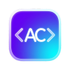

     
    
    <h1>AetherCode</h1>
    <h3>A Fork of VSCode using VSCodium Build Scripts and MantineUI</h3>

**This is a fork of [Microsoft's `vscode` repository](https://github.com/microsoft/vscode) using [MantineUI](https://ui.mantine.dev/) and [VSCodium's Build Scripts](https://github.com/VSCodium/vscodium/)**

## Table of Contents

- [Download/Install](#download-install)
- [Build](#build)
- [Why Does This Exist](#why)
- [More Info](#more-info)
- [Supported Platforms](#supported-platforms)

## Download/Install

:tada: :tada:
Download latest release here:
[stable](https://github.com/Limbo-Development/aethercode/releases)
:tada: :tada:

## Build

Build instructions can be found [here](https://github.com/VSCodium/vscodium/blob/master/docs/howto-build.md)

## Why Does This Exist
We (Limbo Development) forked VSCode to develop AetherCode because we didn't quite like the appearance of VSCode in general, and wanted to see what it would look like with a more smooth/visually appealing look.

If you want to build from source yourself, head over to [Microsoft's vscode repo](https://github.com/Microsoft/vscode) and follow their [instructions](https://github.com/Microsoft/vscode/wiki/How-to-Contribute#build-and-run). This repo exists to make it easier to get the latest version of MIT-licensed Visual Studio Code.

Microsoft's build process (which we are running to build the binaries) does download additional files. Those packages downloaded during build are:

- Pre-built extensions from the GitHub:
  - [ms-vscode.js-debug-companion](https://github.com/microsoft/vscode-js-debug-companion)
  - [ms-vscode.js-debug](https://github.com/microsoft/vscode-js-debug)
  - [ms-vscode.vscode-js-profile-table](https://github.com/microsoft/vscode-js-profile-visualizer)
- From [Electron releases](https://github.com/electron/electron/releases) (using [gulp-atom-electron](https://github.com/joaomoreno/gulp-atom-electron))
  - electron
  - ffmpeg

## More Info

### Documentation

For more information on getting all the telemetry disabled, tips for migrating from Visual Studio Code to VSCodium and more, have a look at [the Docs page](https://github.com/VSCodium/vscodium/blob/master/docs/index.md) page.

### Extensions and the Marketplace

According to the Visual Studio Marketplace [Terms of Use](https://aka.ms/vsmarketplace-ToU), _you may only install and use Marketplace Offerings with Visual Studio Products and Services._ For this reason, AetherCode uses [open-vsx.org](https://open-vsx.org/), an open source registry for Visual Studio Code extensions. See the [Extensions + Marketplace](https://github.com/VSCodium/vscodium/blob/master/docs/index.md#extensions-marketplace) section on the VSCodium Docs page for more details.

Please note that some Visual Studio Code extensions have licenses that restrict their use to the official Visual Studio Code builds and therefore do not work with VSCodium. See [this note](https://github.com/VSCodium/vscodium/blob/master/docs/extensions.md#proprietary-debugging-tools) on the VSCodium Docs page for what's been found so far and possible workarounds.

## Supported Platforms

The minimal version is limited by the core component Electron, you may want to check its [platform prerequisites](https://www.electronjs.org/docs/latest/development/build-instructions-gn#platform-prerequisites).

- [x] macOS (`zip`, `dmg`) macOS 12 or newer x64
- [x] macOS (`zip`, `dmg`) macOS 12 or newer arm64
- [x] GNU/Linux x64 (`deb`, `rpm`, `AppImage`, `tar.gz`)
- [x] GNU/Linux arm64 (`deb`, `rpm`, `tar.gz`)
- [x] GNU/Linux armhf (`deb`, `rpm`, `tar.gz`)
- [x] GNU/Linux riscv64 (`tar.gz`)
- [x] GNU/Linux loong64 (`tar.gz`)
- [x] GNU/Linux ppc64le (`tar.gz`)
- [x] Windows 10 / Server 2012 R2 or newer x64
- [x] Windows 10 / Server 2012 R2 or newer arm64

## License

[MIT](https://github.com/Limbo-Development/aethercode/blob/master/LICENSE)
